# 🐦 Flappy Darwin

A pixel-art **roguelike flappy game** about flying through a living forest,
eating, digesting and evolving. Flap between the great branching trees, manage
your wing energy, catch food on your beak, graze safely along the treetops,
dodge snakes, hawks, carnivorous pitchers and falling durians, chase glowing
bugs — then rest at **the nest**, where each new **generation** of finches
hatches with a fresh mutation. Bank **DNA** across runs and, when you fall,
hatch again from your last checkpoint. Charles Darwin himself guides you in.

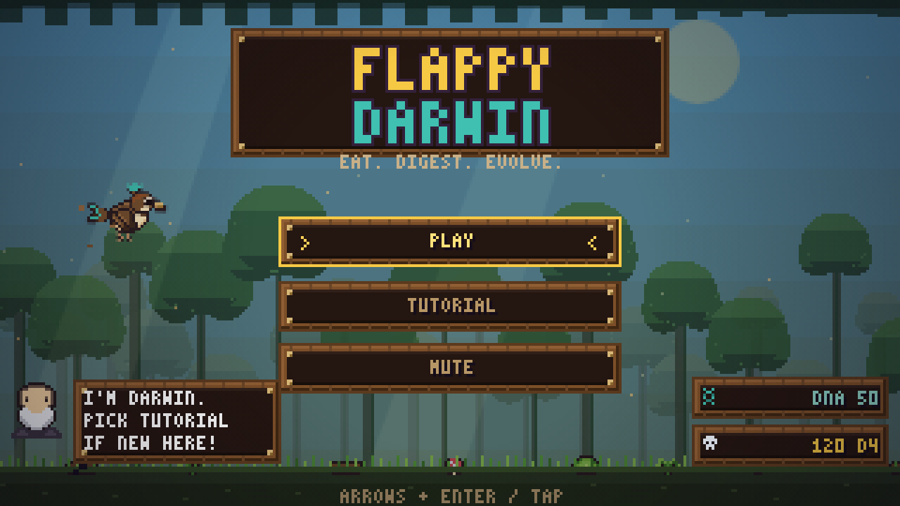

An interactive **Slay-the-Spire-style** main menu: a framed wooden title banner,
glowing card buttons (**PLAY · TUTORIAL · SETTINGS · MUTE**), Darwin's welcome
sign and DNA/best plaques — with distant gulls flapping past and butterflies
fluttering around your perched finch.

## Settings

A wooden **SETTINGS** screen lets you tune the experience:

- **Sound FX** on/off · **Screen shake** on/off · **Hit flash** on/off
- **Difficulty** — EASY / NORMAL / HARD, which changes how soon dangers arrive,
  how long they telegraph, and the pace of flight
- **Reset save** — wipe your DNA, best and progress (with a confirm)

Everything is saved to your browser and persists between runs.

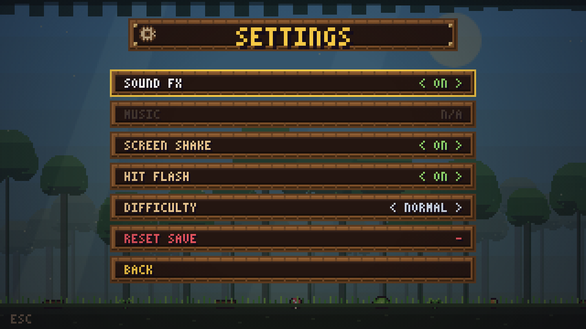

## The run map

At every nest — and any time you pause — a **Slay-the-Spire-style run map**
shows your migration as a ribbon of wooden nodes: the biomes you've crossed,
your **current leg glowing**, and the fork ahead (a **?** for the next choice,
or a **skull** when a boss aerie looms).

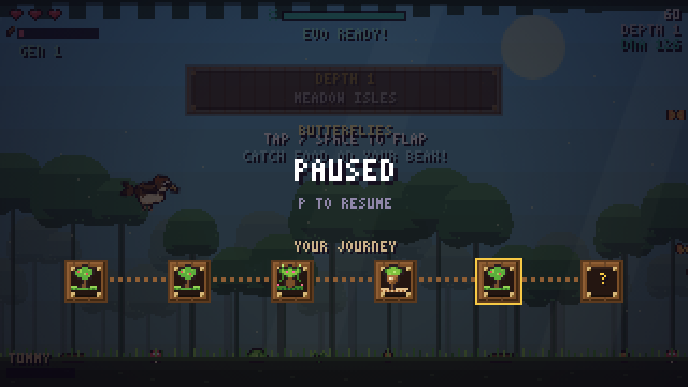

## A gentle beginning

Every run opens with a short **cinematic**: dawn breaks over a nest, an egg
wobbles and cracks, and a new finch is born — then takes its first flight into
the meadow. (Tap to skip.)

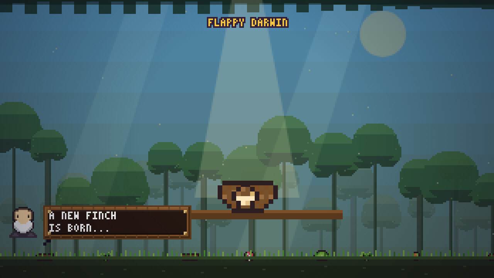

## Meet your guide

**Charles Darwin** teaches you by *doing*, not reading. The first flight is a
purely **action-based tutorial** — each beat waits for you to actually flap,
catch food, digest and graze before moving on.

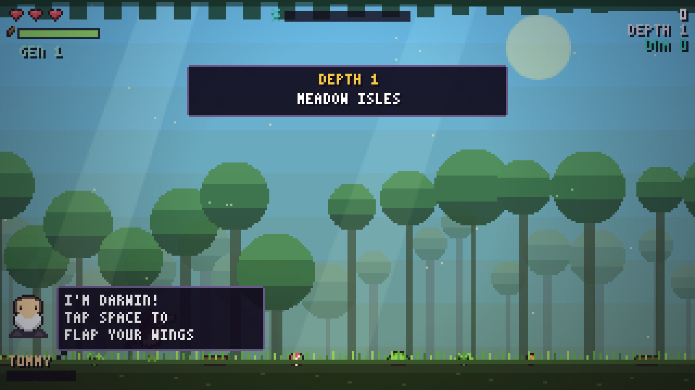

## The game reveals itself

Flappy Darwin **starts simple and grows with you.** The opening legs are just
*flap and eat* — no tired wings, no predators, no clutter. As you migrate
deeper, Darwin returns to introduce **one new system at a time**:

| First reached | Unlocks | Darwin's cue |
|---|---|---|
| Leg 1–2 | flap, eat, digest, graze, hatch | the action tutorial |
| Leg 3 | **wing energy** (flaps start to tire you) | "your wings tire now…" |
| Leg 4 | **danger + combat** (predators, `X` to fight) | "danger ahead — press X!" |
| Leg 5 | **bonus mini-games** | "chase the prizes!" |
| every 4th leg | a **boss** (and the pet it drops) | "a boss — fight back!" |

So there's no wall of mechanics up front — the HUD itself only grows an energy
bar and an attack button once those systems switch on.

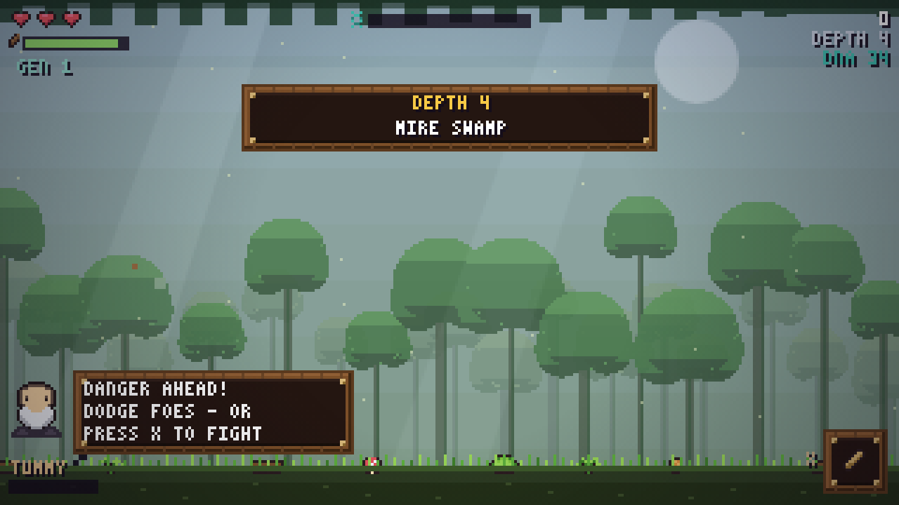

## How to play

Open `index.html` in any modern browser. No build step, no dependencies.

| Input | Action |
|---|---|
| `Space` / `↑` / `W` / tap / click | Flap (costs wing energy; hold to glide, once evolved) |
| `X` / `C` / tap the skill button | **Attack** with your equipped skill (cooldown) |
| `←` `→` / `A` `D` / tap a card | Choose a hatchling trait or migration path |
| `Enter` / `Space` / tap selected card | Confirm choice |
| tap during arrival | Skip the nest cutscene |
| `P` | Pause · `M` Mute · `R` Restart |

## The forest

You're not over the ocean — you're deep in a **living forest**: layered trees
receding into misty depth, shafts of light through the canopy, drifting pollen,
and an undergrowth floor of ferns, bushes, mushrooms and fallen logs. Fall into
the undergrowth and you'll get hurt.

## The loop

1. **Manage your wings.** Every flap spends **wing energy** (the green bar).
   It refills over time, faster while **gliding**, and topping it up by
   **eating** and **grazing treetops** — so when you run low, slide and feast
   instead of hammering the flap key.
2. **Graze, don't crash.** The leafy **tops of trees are soft** — skim and slide
   along a canopy safely (it even restores energy). Only the woody **trunk
   core** deals damage.
3. **Eat.** Food floats in your path — seeds, berries, nectar, nuts, grubs,
   frogs, mangoes and rare golden fruit. Catch it **on your beak** and it sits
   there while you **digest**. You can't grab more until it goes down — and
   over-gulping leaves you **STUFFED**: heavy and weak-winged.
4. **Bonus mini-games.** Between obstacles a surprise event may appear — seven in all:
   - 🐛 **Bug chase** — a glowing beetle darts ahead; pursue and snatch it.
   - 💨 **Thermal ring** — fly cleanly through the glowing hoop for a PERFECT
     boost, full energy and bonus.
   - 🍓 **Fruit rush** — a wave of fruit floods in; feast for a combo bonus.
   - 💍 **Ring slalom** — a chain of hoops; thread them all for an escalating combo.
   - ✨ **Firefly trail** — a curving chain of glowing fireflies to collect.
   - 🌰 **Nut storm** — a rain of acorns; survive unscathed for a big bonus.
   - 🦋 **Butterfly dance** — a friendly cloud to glide through for energy and points.

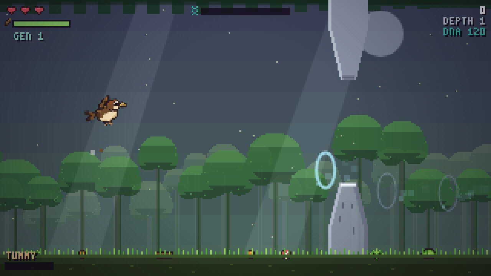
5. **Boost to escape.** Double-tap (double-click / double-press) to **dash** — a
   burst of speed that costs wing energy. Use it to outrun what's chasing you.
6. **Dodge the dangers.** Every threat is **telegraphed and fair**:
   - 🐍 **Canopy snakes** rear up and strike — and if one hits, it **latches on**;
     **tap fast (swipe 5×) to shake it off** before it drains you.
   - 🦅 **Falcons** chase you down from behind — **boost away** or juke them.
   - 🕷️ **Spiders** drop on a silk thread into the gap — weave above or below.
   - 🐝 **Wasp swarms** buzz in and home on you — keep moving to lose them.
   - 🌿 **Pitcher plants** bubble in the undergrowth, then lunge — stay high.
   - 🦅 **Hawks** cast a warning shadow, then dive — drop low.
   - 🥭 **Durians** hang from branches and *drop* when you near them — move!
   - 🦇 **Bats** screech in, then flit across in an erratic, homing zigzag.
   - 🪰 **Dragonflies** hover to lock your lane, then **dash** straight across it.
   - 🐸 **Bullfrogs** crouch on the floor, then **leap** in a tall arc — mind the gap.
   - 🎐 **Jellyfish** drift up through ocean lanes, pulsing — weave around the sting.
   - 🐟 **Piranhas** break the water in a quick burst of leaps — thread between them.
   - 🦅 **Vultures** circle overhead marking your lane, then **dive** once, hard.
   - 🪲 **Shieldbugs** drift in like armored walls — 6 HP tanks worth shooting down.
   - 🐝 **Hornet nests** hang under the canopy releasing hornets — destroy the
     nest to stop the swarm.

## Combat: fight back!

Your finch isn't just prey anymore. Press **X** (or tap the skill button) to
**attack** with your equipped skill. Every enemy now has **health** — chip it
down for score, DNA and the occasional dropped snack, and watch the little
HP bars and damage numbers fly.

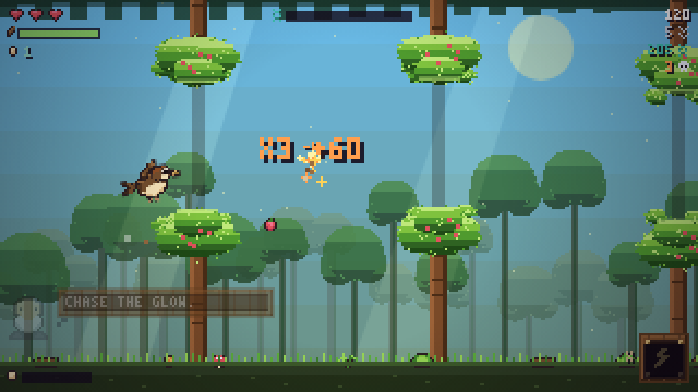

**10 attack skills**, each with its own icon, cooldown and effect — and every
nest offers a new one on an orange **ATTACK SKILL** card next to the trait
cards:

| Skill | Effect |
|---|---|
| 🐤 **Power Peck** | lunge and strike in front of you |
| 🌰 **Seed Shot** | spit a fast seed projectile |
| 🪶 **Feather Volley** | a fan of three quills |
| 🌙 **Wing Slash** | an arc that hits all around you |
| 🎵 **Sonic Chirp** | an expanding wave that hits every foe on screen |
| 🥚 **Egg Bomb** | a lobbed egg that explodes in an area |
| 🌪️ **Gust Vortex** | a slow piercing twister that hits everything it passes |
| ⚡ **Storm Call** | lightning smites the nearest foe |
| ☀️ **Sun Ray** | a beam across the whole sky lane |
| 🧪 **Venom Spit** | poisons a foe to take damage over time |

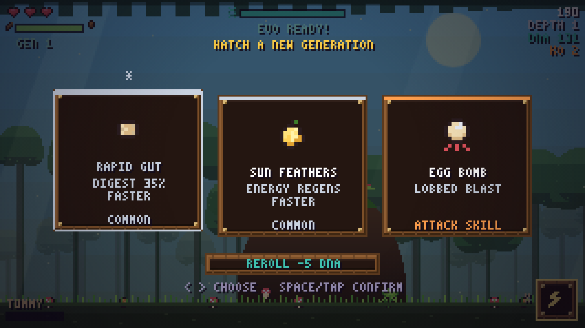

## Diet passives

Devotion to one food group awakens a **passive ability** mid-run:

- 🍒 **Berry Vigor** (8 berries) — every 8th berry heals a heart
- 🌱 **Swift Wings** (8 seeds) — flaps cost 20% less
- 🌰 **Hard Shell** (8 nuts) — a shield every leg
- 🐛 **Hunter Gut** (8 bugs) — attacks deal +1 damage
- ✨ **Midas Glow** (3 golden fruit) — food is worth +50%

Active passives show as little badges by your energy bar.

## Three area bosses

Every 4th migration the path leads to a **boss arena** — and the three bosses
**rotate** as you go deeper. Dodge their telegraphed patterns *and* fight
back — your attacks damage the boss directly:

- 🦅 **The Great Eagle** (the Aerie) — dive-bombs, talon sweeps, feather-storms
- 🐍 **The Serpent King** (the Serpent Pit) — floor eruptions, head sweeps,
  venom lobs
- 🦉 **The Frost Owl** (the Frozen Gale) — talon dives, ice shards, and
  freezing up/downdrafts you must fight against

Drive one off for +1 heart, a DNA jackpot — **and a cute pet**.

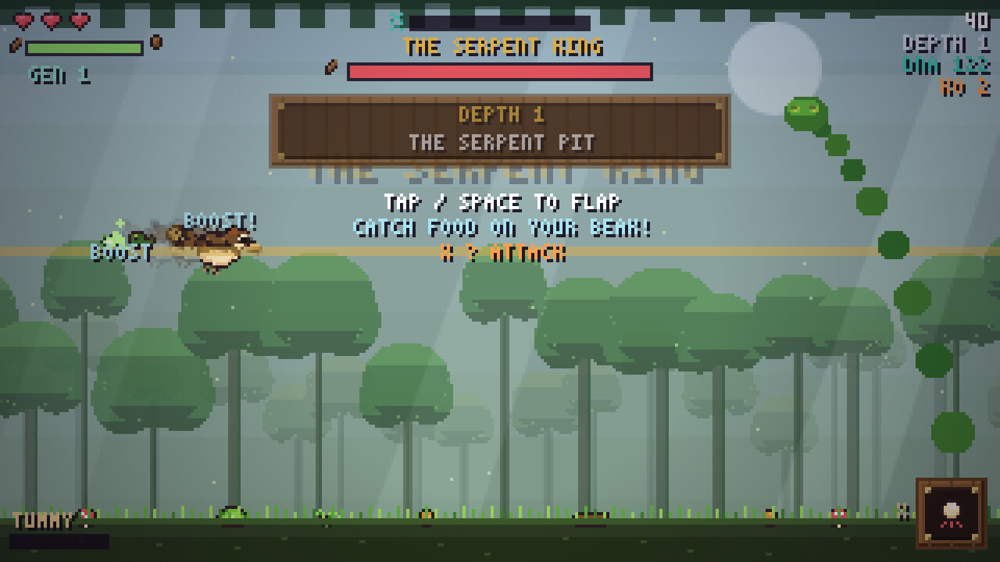

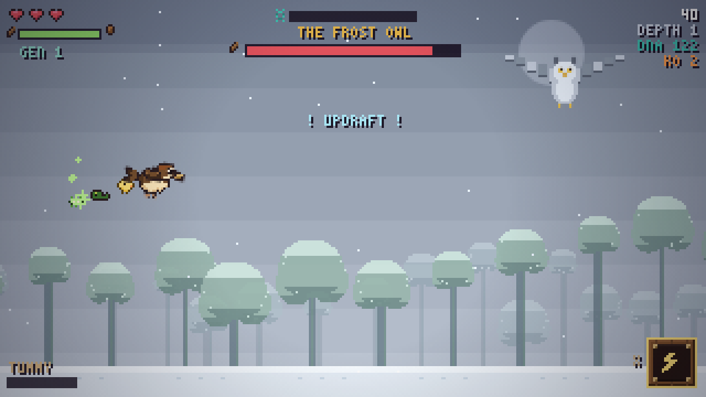

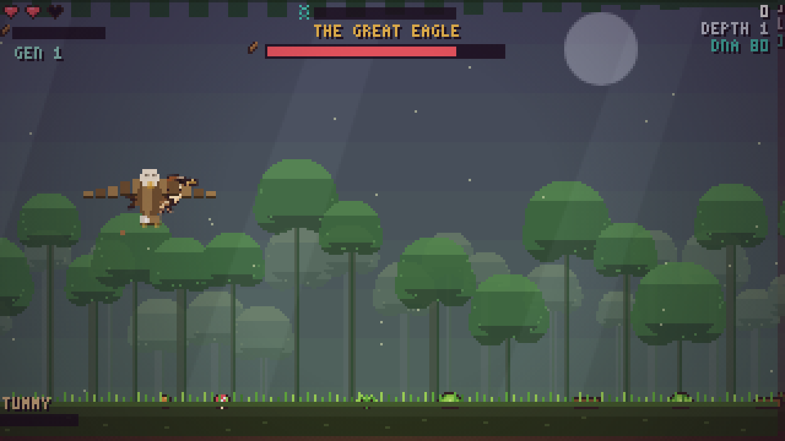

## Cute pets

Each boss you defeat tames a companion that flutters along behind you in a
little trail:

- 🐤 **Pip the Chick** — pecks at nearby enemies
- 🐍 **Noodle the Snake** — nudges food toward your beak
- ✨ **Lumen the Firefly** — slowly recharges your wing energy

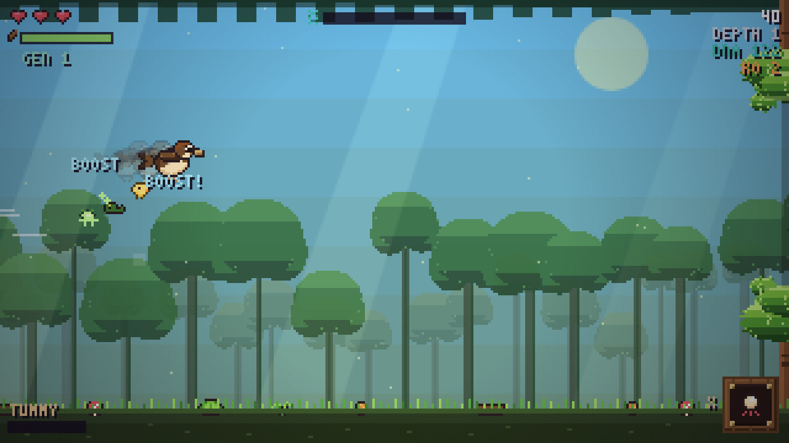

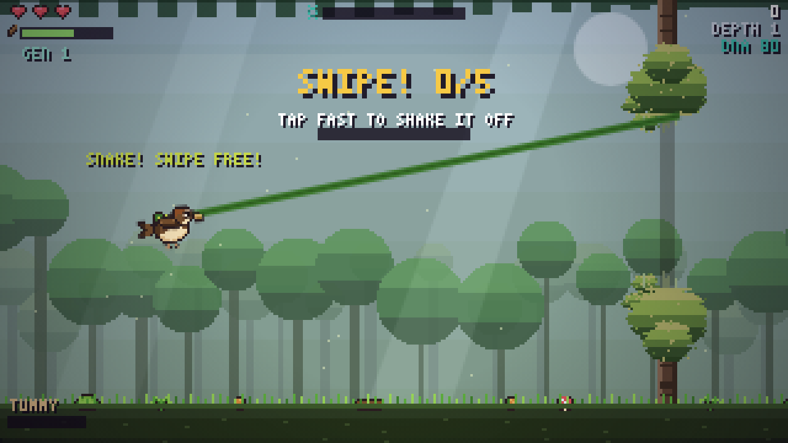
6. **Rest at the nest.** Arriving at a grove triggers a landing cutscene with a
   sweeping **overview pan** across the clearing. When enough food is banked, an
   egg in the nest **hatches a new generation** — you pick the trait it
   inherits — then you choose your next migration path.

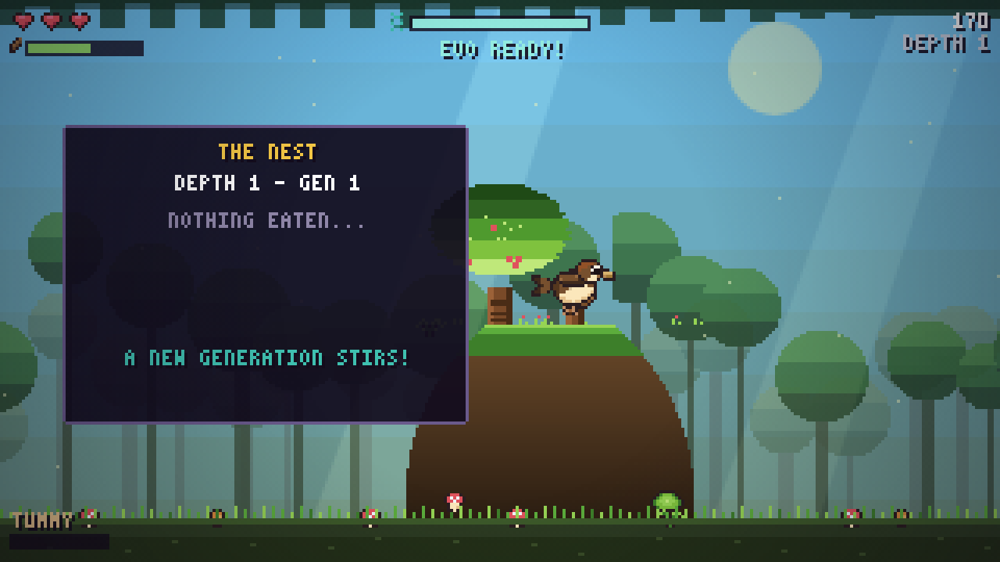

## Generations, traits & DNA

Digested food fills your **hatch meter**. At the nest a new generation hatches
and inherits one of three traits, drawn by **rarity** — COMMON,
**RARE** or **EPIC** — and weighted by what your flock has been eating. Spend
banked **DNA** to **reroll** the offered traits.

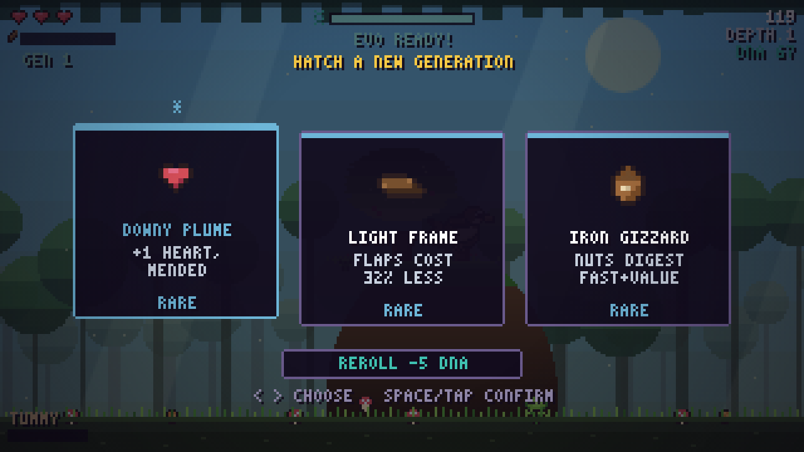

**DNA is permanent.** You earn it every run and it is saved between runs. Each
leg you reach becomes a **checkpoint**, so when a finch dies you can **hatch
again from your last nest** — for a cost in DNA — keeping your build and depth,
or start a fresh **new lineage**.

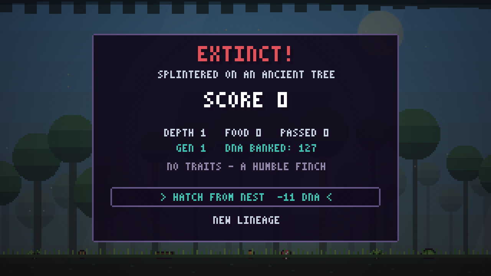

Traits: Mighty Wings · Hollow Bones · Tail Rudder · Glider Wing · Wide Beak ·
Rapid Gut · Crop Pouch · Iron Gizzard · Downy Plume · Sweet Tooth · Bug Snatcher ·
Feather Shield · Second Stomach · Big Lungs · Light Frame · Sun Feathers ·
Keen Forager · Nimble Frame · Iron Beak · **Aerial Master** · **Apex Instinct**.

## Biomes & environments

Ten biomes across four environments — forest, ocean, tundra and desert — each
with its own trees/obstacles, light, food and dangers. Paths branch and
difficulty ramps the deeper you migrate.

| Biome | Env | Obstacles | Hazards |
|---|---|---|---|
| 🌼 **Meadow Isles** | forest | leafy oaks | — |
| 🌲 **Pinewood Reach** | forest | conifers | durians |
| 🌰 **Oaknut Grove** | forest | golden oaks | pitchers, durians, bullfrogs |
| 🐛 **Buzzing Marsh** | forest | mangroves | dragonflies, bullfrogs |
| 🐍 **Mire Swamp** | forest | cypress | snakes, pitchers, bats |
| ⛰️ **Storm Crags** | forest | rock spires | hawks, falcons, vultures, gusts |
| 🌴 **Lush Jungle** | forest | broadleaf + vines | everything, bats, dragonflies |
| 🌊 **Coral Coast** | ocean | swaying palms | falcons, jellyfish, piranhas |
| ❄️ **Frost Reach** | tundra | snow-laden pines | falcons, hawks, bats, gusts |
| 🏜️ **Dune Sea** | desert | saguaro cacti | snakes, falcons, vultures |

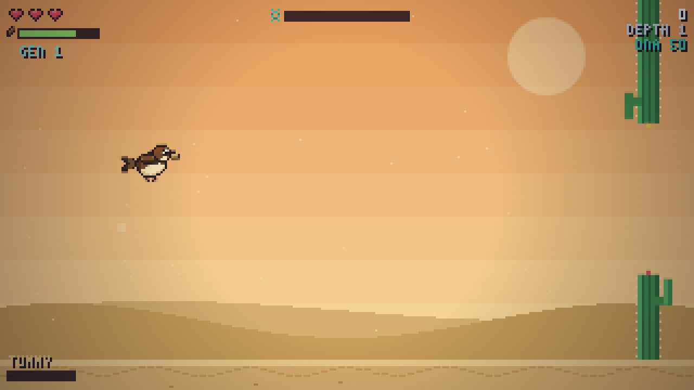

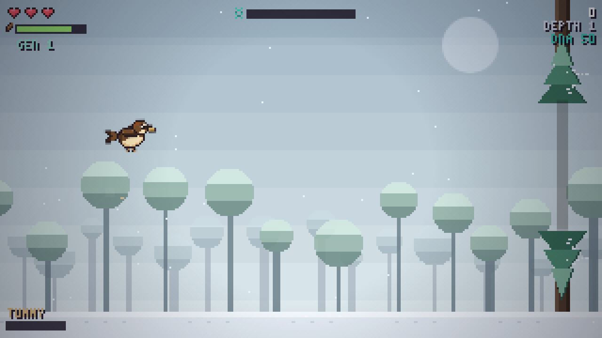

Traits stack across generations and **visibly change the bird** — bigger wings,
wider beak, a fanned tail, a growing crest. Every run is procedural: layouts,
food, paths and dangers differ each time.

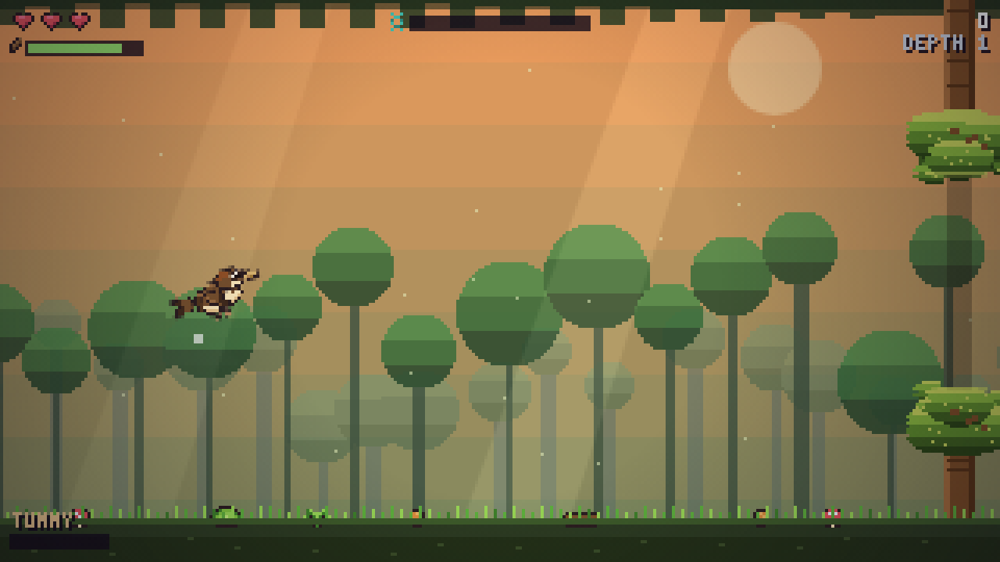

## Look & feel

- A **Slay-the-Spire-style** interactive main menu — a framed wooden title
  banner, glowing wooden card buttons, Darwin's sign, DNA/best plaques, and
  ambient life (drifting gulls, fluttering butterflies).
- A dedicated **settings** screen (sound, screen shake, hit flash, difficulty,
  reset) and a **run map** ribbon shown at every nest and on pause.
- A cohesive **wooden, Stardew-Valley-style UI** across every panel, card and
  sign — carved frames, dark boards and corner nails.
- Layered, branchy **background forests** with lit organic canopies and depth,
  god-rays, drifting pollen and per-biome light.

## Tech

- Pure vanilla JavaScript + HTML5 canvas, **zero dependencies**
- 320×180 internal resolution, integer-scaled with crisp pixels
- Every sprite authored in-code as pixel character maps (`js/sprites.js`)
- Procedural forest, trees, grove, parallax depth and light drawn per-pixel
  (`js/game.js`)
- All sound effects synthesized live with WebAudio (`js/audio.js`)
- 3×5 bitmap font (`js/font.js`)

`tools/preview.html` renders the whole sprite sheet for art iteration.
