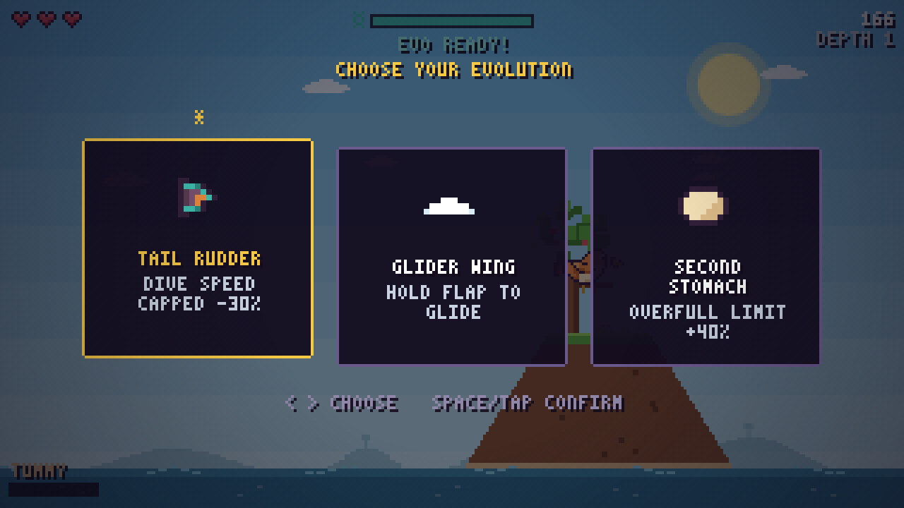

# 🐦 Flappy Darwin

A pixel-art **roguelike flappy game** about eating, digesting and evolving.
Flap across an archipelago of islands, catch food on your beak, wait for it to
digest, and let your diet shape your evolution — or go extinct trying.

## How to play

Open `index.html` in any modern browser. No build step, no dependencies.

| Input | Action |
|---|---|
| `Space` / `↑` / `W` / tap / click | Flap (hold to glide, once evolved) |
| `←` `→` / `A` `D` / tap a card | Choose evolution or migration path |
| `Enter` / `Space` / tap selected card | Confirm choice |
| `P` | Pause |
| `M` | Mute |
| `R` | Restart |

## The loop

1. **Flap** between islands, weaving through ancient trees, marsh boughs and
   storm-carved rock spires. You have hearts — clipping an obstacle or the sea
   costs one.
2. **Eat** — food floats in your path: berries, seeds, nuts, bugs and rare
   golden fruit. You catch food **on your beak**, and it sits there while you
   **digest** it. You can't grab more until it goes down — and if you gulp too
   much too fast you get **STUFFED**: heavy, weak-winged and sluggish until
   your tummy settles.
3. **Land** on an island, then **choose your migration path**. Each island
   biome offers different food and different dangers:
   - 🍒 **Meadow Isles** — berries and gentle trees
   - 🌰 **Oaknut Grove** — hearty nuts, dense canopy
   - 🐛 **Buzzing Marsh** — quick bugs among tangled boughs
   - ⛰️ **Storm Crags** — rich pickings, wild wind gusts
4. **Evolve** — food fills your evolution meter. At the next island you pick
   one of three mutations, and *what you ate weights what you're offered*:
   a nut-heavy diet grows a wider beak and an iron gizzard, a berry diet
   grows mightier wings and hollow bones, a bug diet sharpens your gut.

## Mutations

Mighty Wings · Hollow Bones · Tail Rudder · Glider Wing · Wide Beak ·
Rapid Gut · Crop Pouch · Iron Gizzard · Downy Plume · Sweet Tooth ·
Bug Snatcher · Feather Shield · Second Stomach

Your bird visibly changes as it evolves — bigger wings, wider beak, tail fans
and a growing crest. Every run is procedural: layouts, food and paths differ,
death is permanent, and only your best score survives (stored locally).

## Tech

- Pure vanilla JavaScript + HTML5 canvas, zero dependencies
- 320×180 internal resolution, integer-scaled with crisp pixels
- All sprites authored in-code as pixel character maps
- All sound effects synthesized live with WebAudio
- Day → dusk → night sky as you migrate deeper
