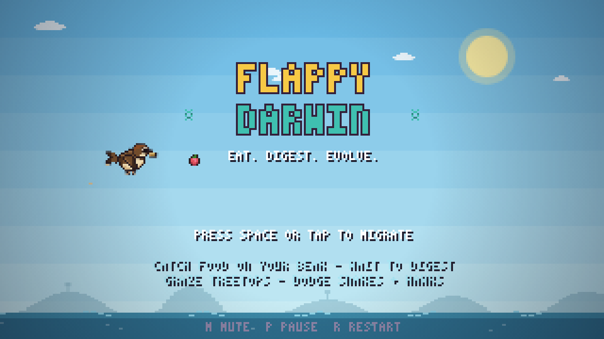
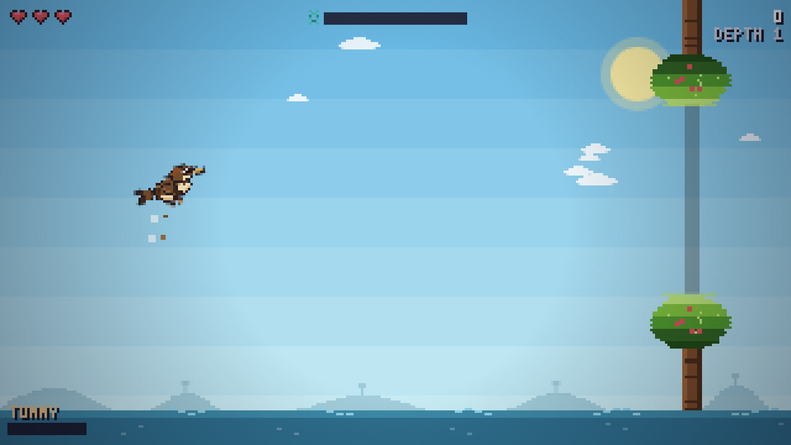
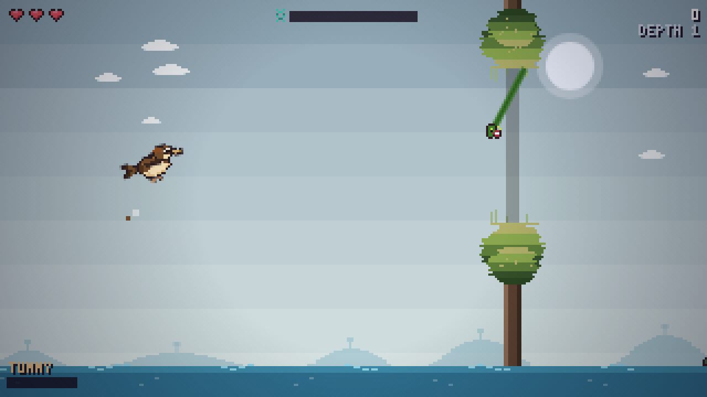
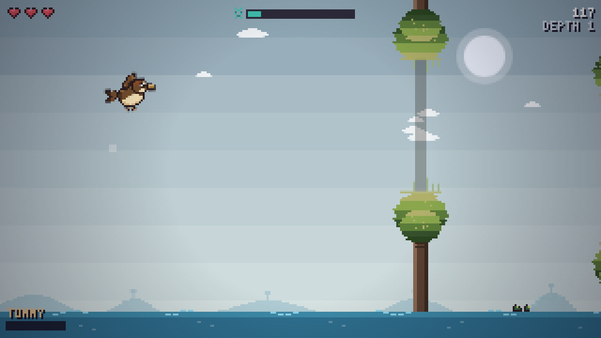
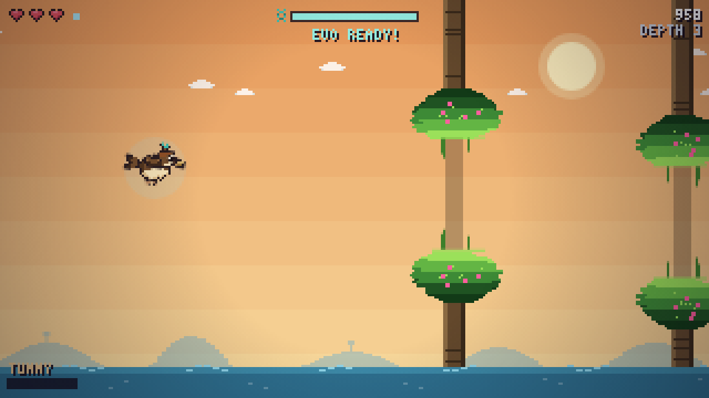
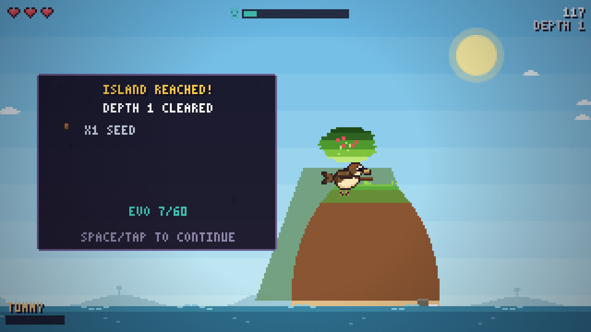

# 🐦 Flappy Darwin

A pixel-art **roguelike flappy game** about eating, digesting and evolving.
Flap across an archipelago of lush islands, catch food on your beak, wait for it
to digest, graze safely along treetops, dodge snakes and hawks, land on real
islands, choose your migration path — and let your diet shape your evolution,
or go extinct trying.

## How to play

Open `index.html` in any modern browser. No build step, no dependencies.

| Input | Action |
|---|---|
| `Space` / `↑` / `W` / tap / click | Flap (hold to glide, once evolved) |
| `←` `→` / `A` `D` / tap a card | Choose evolution or migration path |
| `Enter` / `Space` / tap selected card | Confirm choice |
| tap during landing | Skip the landing cutscene |
| `P` | Pause · `M` Mute · `R` Restart |

## The loop

1. **Flap** between islands, weaving through lush trees, marsh roots, cypress
   boughs, pines and jungle canopies. You have hearts — slamming a **trunk**,
   a rock, the sea or a predator costs one.
2. **Graze, don't crash.** The leafy **tops of trees are soft** — you can skim
   and slide along a canopy safely, rustling leaves. Only the woody **trunk
   core** and rock hurt you. Learn to ride the treetops.
3. **Eat.** Food floats in your path — seeds, berries, nectar, nuts, grubs,
   frogs, mangoes and rare golden fruit. You catch food **on your beak**, and it
   sits there while you **digest** it. You can't grab more until it goes down —
   gulp too much too fast and you get **STUFFED**: heavy and weak-winged until
   your tummy settles.
4. **Dodge predators.** Deeper biomes are hunted. Every threat is **telegraphed
   and fair**:
   - 🐍 **Canopy snakes** rear back in the trees (watch the aim-dots) then strike
     — climb or dip to slip the lane.
   - 🐊 **Bog snappers** ripple and bubble at the waterline before lunging — stay
     high.
   - 🦅 **Hawks** cast a warning shadow on your lane, then dive — drop low.
5. **Land** on a real island — a short cinematic flares you down onto a perch —
   then **choose your migration path**.

## Biomes

Seven biomes, each with its own trees, food, sky and dangers. Paths branch and
difficulty ramps the deeper you migrate.

| Biome | Look | Food | Hazards |
|---|---|---|---|
| 🌼 **Meadow Isles** | bright leafy oaks | berries, seeds | — |
| 🌲 **Pinewood Reach** | misty conifers | seeds, nuts | — |
| 🌰 **Oaknut Grove** | dense golden oaks | nuts | — |
| 🐛 **Buzzing Marsh** | mangroves + reeds | bugs | — |
| 🐍 **Mire Swamp** | mossy cypress | grubs, frogs | snakes, snappers |
| ⛰️ **Storm Crags** | rock spires | golden fruit | hawks, wind gusts |
| 🌴 **Lush Jungle** | broadleaf + vines | mango, gold | snakes, hawks |

## Evolve

Digested food fills your **evolution meter**. At islands you pick one of three
mutations, and *what you ate weights what you're offered* — a nut diet grows a
wider beak and iron gizzard, a berry diet grows mightier wings and hollow bones,
a bug diet sharpens your gut. Your bird **visibly changes** as it evolves:
bigger wings, wider beak, a fanned tail rudder, a growing crest.

**Mutations:** Mighty Wings · Hollow Bones · Tail Rudder · Glider Wing ·
Wide Beak · Rapid Gut · Crop Pouch · Iron Gizzard · Downy Plume · Sweet Tooth ·
Bug Snatcher · Feather Shield · Second Stomach

Every run is procedural — layouts, food, paths and hazards differ, death is
permanent, and only your best score survives (stored locally).

## Feel

- **Realistic pixel bird** — an anatomically detailed finch, believably small
  against the trees (1:1 scale), with layered wing feathers, a forked tail and
  a shaded cream belly.
- **Lush layered trees** — depth-shaded canopies, textured bark, roots, hanging
  moss and vines, per biome.
- **Juice** — squash-and-stretch flaps, catch-pop with a sparkle ring and micro
  hitstop, leaf bursts when you graze, near-miss whooshes, slow-mo on a clean
  predator dodge, an evolve fanfare, landing dust and settle-bob, screen shake
  and freeze-frames.
- **Forgiving** — generous gaps, a gentle first island, a small hitbox, brief
  invulnerability each leg, and soft treetops make it approachable; the deeper
  biomes and predators supply the challenge.

## Tech

- Pure vanilla JavaScript + HTML5 canvas, **zero dependencies**
- 320×180 internal resolution, integer-scaled with crisp pixels
- Every sprite authored in-code as pixel character maps (`js/sprites.js`)
- Procedural trees, islands and parallax skies drawn per-pixel (`js/game.js`)
- All sound effects synthesized live with WebAudio (`js/audio.js`)
- 3×5 bitmap font (`js/font.js`)

`tools/preview.html` renders the whole sprite sheet for art iteration.
