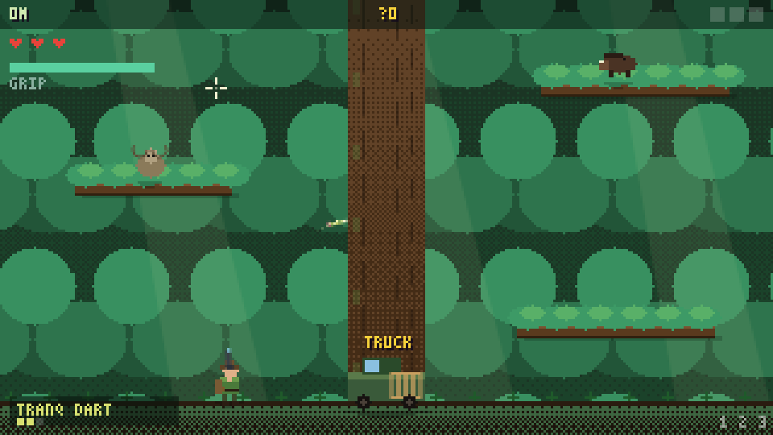
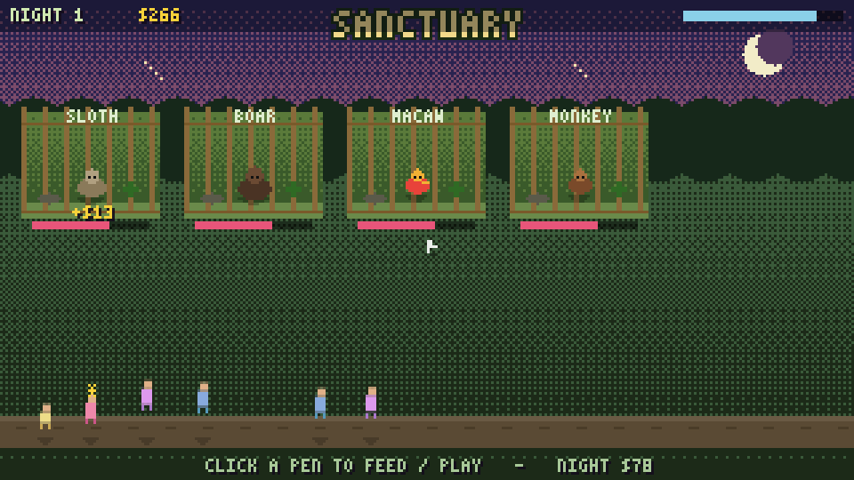
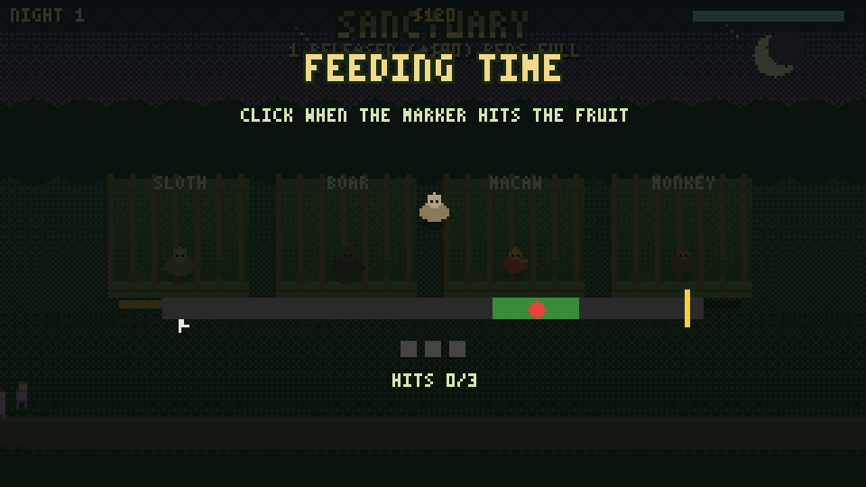

# 🌿 Canopy Rangers — Amazon Wildlife Hunter

A pixel-art **wildlife-hunter take on the _Dave the Diver_ loop**. Instead of
diving **down** into the ocean, you climb **up** into the Amazon rainforest:
swing on vines, fire a **grappling hook**, and **tranquilize** wild animals with
a dart gun — then carry them back to your truck for transport to your **wildlife
sanctuary**. By night you run the sanctuary: feed and play with your animals,
welcome paying visitors, and spend the takings on better gear and new
enclosures. Then you head back up the trees and do it all again.

## How to play

Open `index.html` in any modern browser. No build step, no dependencies.
Everything (art, sound, world) is generated in code.

### ☀️ Day — the expedition (climb & tranquilize)

| Input | Action |
|---|---|
| `A` `D` / `←` `→` | Move · steer / pump your swing |
| `Space` | Jump (grounded) · **let go** of the rope (swinging) |
| **Mouse** | Aim |
| **Left-click** / `J` | Fire tranq dart |
| **Right-click** / `F` | Fire **grappling hook**, then swing |
| `W` `S` (while swinging) | Reel in / pay out the line |
| `1` `2` `3` | Tranq Dart · Heavy Dart · Capture Net |
| `R` | Reload |
| `E` (at the truck) | Drive your catch to the sanctuary |

The climb is the heart of the game:

1. **Ascend the layers.** Jump between branches, grapple onto higher ones and
   reel up, and swing across gaps on vines. The higher you go, the **rarer and
   more dangerous** the wildlife.
2. **Mind your GRIP.** The green **grip meter** is your "oxygen" — it drains
   while you hang on ropes and vines and refills when you stand on a solid
   branch. Run it dry and you start to slip.
3. **Tranquilize, don't kill.** Aim with the mouse and dart animals until their
   little **sedation bar** fills. Different ammo suits different quarry — light
   darts for macaws, **heavy darts** for a jaguar, a **capture net** to bag a
   tricky target instantly.
4. **Stay safe.** Boars **charge**, snakes **strike**, jaguars **pounce** — read
   the tell, dart them, or swing clear. Take too many hits and you're knocked
   out and lose half your catch.
5. **Stow & extract.** Walk over a sedated animal to load it onto your back
   (limited **cargo slots**), then return to the **truck** and press `E` to
   drive everything to the sanctuary.

**Animals:** 🦜 Macaw · 🐒 Monkey · 🐗 Boar · 🐍 Snake · 🦥 Sloth ·
🦤 Toucan · 🐆 Jaguar · ✨ Golden Frog — each in its own layer of the canopy,
with its own behaviour, danger and rarity/value.

### 🌙 Night — the sanctuary (feed, play, earn)

Your rescued animals fill the enclosures. Click a pen to **Feed** or **Play**:

- **Feeding** is a timing minigame — click when the marker crosses the fruit.
- **Playtime** is a mash minigame — keep the ball bouncing.

Happy, well-fed animals draw bigger tips from the **visitors** who stroll the
path and pay to admire each exhibit. Hunger drifts down over the night, so keep
your residents fed. When the night ends you bank your **admission earnings**.

### 🛒 The Outfitter (between days)

Spend your money on a branching upgrade tree:

- **Gun** — bigger magazine, faster reload, more potent serum
- **Climb** — more grip, longer grapple line, higher jump
- **Cargo** — extra carry slots
- **Sanctuary** — new enclosures, premium feed, décor that boosts spending
- **Ammo** — restock heavy darts and capture nets

Progress and your sanctuary are **saved automatically** between days.

## The loop

**Menu → choose a region → expedition (climb + tranq + capture) → drive to the
sanctuary → run the night (feed / play / visitors) → the Outfitter → next day.**
Deeper regions unlock as the days go by, with rarer wildlife and steeper danger.

## Tech

- Pure vanilla JavaScript + HTML5 canvas, **zero dependencies**
- 320×180 internal resolution, integer-scaled with crisp pixels
- All sprites drawn **procedurally** with dithered "3D-pixel" shading, parallax
  canopy depth, god-rays, drop shadows and particle juice (`js/hunter.js`)
- Verlet-style rope **pendulum physics** for grappling & vine swinging
- All sound effects synthesized live with WebAudio (`js/audio.js`)
- 3×5 bitmap font (`js/font.js`)

Add `?dev=1` to the URL to expose a small `window.CR` debug helper.
